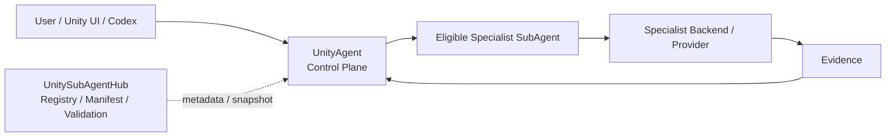

<h1 align="center">UnitySubAgentHub</h1>

<p align="center"><strong>Optional Specialist SubAgentsの Registry / Catalog / Manifest / Schema / Validation Hub。</strong></p>

<p align="center">
  <a href="VERSION"></a>
  <a href="https://github.com/DarumaPPAP/UnitySubAgentHub/actions/workflows/subagent-hub-contract.yml"></a>
  
  <a href="LICENSE"></a>
</p>

<p align="center">
  <a href="#role">Role</a> ·
  <a href="#system-position">System Position</a> ·
  <a href="#registry">Registry</a> ·
  <a href="#eligibility">Eligibility</a> ·
  <a href="#add-a-specialist">Add a Specialist</a> ·
  <a href="Design/subagent-hub-architecture.md">Architecture</a> ·
  <a href="docs/references/unity-cli-reference.md">Unity CLI Reference</a>
</p>

> [!IMPORTANT]
> **UnityAgentが唯一のControl Planeです。** UnitySubAgentHubはRequest Resolver、Runtime、Orchestrator、Installerではありません。HubはOptional SubAgentのmetadataとvalidationを提供し、実行可否の判断と実行そのものはUnityAgentが担当します。

UnitySubAgentHub is a static registry and contract catalog for optional UnityAgent specialist SubAgents. It does not route user requests, execute specialist work, install capabilities, or own runtime orchestration.

## Role

UnitySubAgentHubは、Unity開発向けOptional Specialist SubAgentのIdentity、Lifecycle、Capability、Compatibility、Dependency、Backend、Evidence契約を登録・検証するmetadata Hubです。

| Does | Does Not |
|---|---|
| Registry Index | User request routing |
| Canonical SubAgent Manifest | Runtime execution |
| Shared Schema | Orchestration |
| Fail-Closed Validation | Automatic installation |
| Catalog Snapshot generation | Project / Environment state ownership |
| Lifecycle / Compatibility contract | Policy / Approval authority |
| Cross-reference validation | Backend dispatch / Retry / Fallback |

Registry登録は、installed / compatible / project-bound / available / eligible / executableを意味しません。すべてのSubAgentはOptionalです。

## System Position



Hubは実行経路のControl Planeではありません。Manifestは「候補になるための契約」を宣言し、現在のProject状態はUnityAgentがRuntimeで観測します。

## Core Rules

- **Optional by default** — SubAgent導入は必須ではありません。
- **No auto-install** — Capability解決のためにSubAgentを自動Installしません。
- **Manifest is canonical** — 各Specialistの正本は `SubAgents/<id>/manifest.yaml` です。
- **Fail-Closed** — 必須条件がfalse / unknown / unavailableなら候補から除外します。
- **Lifecycle before ranking** — 新しいCapability解決では `active` のSpecialistだけを対象にします。
- **Identity != Backend** — Specialist identityと実行Backend IDを分離します。
- **Hub != Runtime** — RegistryやSnapshot公開だけで実行可能になったとは扱いません。

## Registry

現在登録されているProduction Specialist:

| Specialist | Canonical ID | Backend / Provider ID | Lifecycle |
|---|---|---|---|
| ArtistSubAgent | `artist_subagent` | `unity_artist_cli` | `active` |

ArtistSubAgentは専門AgentのIdentityです。

- `artist_subagent` — Specialist identity
- `unity_artist_cli` — Current backend/provider ID
- `unity-artist` — Host CLI executable
- `com.darumappap.unity-artist` — Unity Package ID

これらを同じIdentityとして扱いません。

Resolver-visible Capability:

- `artist.camera.inspect`
- `artist.camera.refine`
- `visual.capture`

Backend CLIの全コマンドやContractに存在する広い機能は、ManifestとUnityAgent Runtimeの両方で対応されるまでResolver候補ではありません。

## Manifest Contract

Canonical files:

| Concern | Canonical Source |
|---|---|
| Registry index | `Registry/subagents.yaml` |
| Specialist identity / lifecycle / capability / compatibility / backend / evidence | `SubAgents/<id>/manifest.yaml` |
| Registry / Manifest structure | `Schemas/` |
| Specialist-specific behavior / acceptance | Manifestが参照する `contracts/` |
| Architecture / addition rules | `Design/subagent-hub-architecture.md` |
| Resolution / execution policy | [UnityAgent](https://github.com/DarumaPPAP/UnityAgent) |

`Registry/subagents.yaml` はManifest PathのIndexです。環境固有のInstall状態やProject Bindingを保存しません。

## Eligibility

EligibilityはRankingより先に評価されます。

```text
registered → discovered → installed → compatible → project_bound
           → available → eligible → ranked
```

ArtistSubAgentのrequired activation gates:

- `unity_artist_cli.available`
- `unity_artist_cli.compatible`
- `unity_artist_cli.project_bound`
- `unity_artist_cli.package_installed`
- `unity_artist_cli.pipeline_reachable`

必須の環境事実がtrueでない場合、SpecialistはResolution候補から除外されます。条件を満たす候補がなければ `unavailable` を返します。

Installは別の明示的なSetup操作です。

## Compatibility

ArtistSubAgent Manifestが現在宣言するsupported targets:

| Unity | Render Pipeline |
|---|---|
| Unity 6.x+ | Built-in |
| Unity 6.x+ | URP |
| Unity 6.x+ | HDRP |

CompatibilityはManifestで宣言されますが、現在のProjectが実際に対応しているかはUnityAgentがEnvironment factsとして観測します。

## Snapshot Integration

Hub CIはActive Manifestを検証したうえで、データ専用の `UnityAgent-SubAgent-Catalog-Snapshot` Artifactを生成します。

Exporterは現在、以下をUnityAgent ReferenceImplementation profile形式として出力します。

- Profile ID: `artist_subagent`
- Provider ID: `unity_artist_cli`
- Resolver-visible capabilities
- Required evidence
- Optional install / `auto_install: false`
- Required activation environment gates
- Scope / value / approval / evidence provenance

UnityAgent `main` は、現在Repository内の `Runtime/ReferenceImplementation/subagent-catalog.yaml` を読み込みます。Hub CI Artifactを自動取得・同期する経路は現行コードにはありません。

したがって、**Artifact公開 != UnityAgent Runtimeへ同期済み** です。HubとUnityAgentのProfile contractを変更するときは、両Repositoryで同時に検証してください。

Artistの現行runtime provenanceは `UnityAgent.ReferenceImplementation.v1.1` です。Consumer側が別Revisionを持つ場合、Snapshotを自動補正せず、契約差分としてImport Gateでブロックします。Compatibility Factの生成・観測はHubでは行わず、UnityAgentのEnvironment discoveryが担当します。

## Add a Specialist

1. `Schemas/subagent-manifest.schema.json` に従って `SubAgents/<id>/manifest.yaml` を作成します。
2. Optional Install、`auto_install: false`、Lifecycle、false / unknown時のFail-Closed behaviorを定義します。
3. Required dependencyごとに `activation.required_before_resolution` のGateを定義します。
4. Resolver-visible Capability、supported Unity / Render Pipeline target pairs、Dependency、Backend、Evidence Contractを宣言します。
5. Manifest Pathだけを `Registry/subagents.yaml` へ登録します。
6. Hub validationを実行します。

```sh
python Tests/Hub/validate_registry.py
python -m unittest discover -s Tests/Hub -p 'test_*.py' -v
python Tests/Hub/export_agent_snapshot.py --output /tmp/subagent-catalog.yaml
```

Registryへの追加はdata-onlyです。新しいCapability semanticsを追加する場合は、UnityAgent Runtime側の対応も必要です。

## ArtistSubAgent

- [ArtistSubAgent Guide](SubAgents/artist_subagent/README.md)
- [Canonical Manifest](SubAgents/artist_subagent/manifest.yaml)
- [Hub Architecture](Design/subagent-hub-architecture.md)
- [Migration from MyUnityMCP](MIGRATION_FROM_MYUNITYMCP.md)

このRepositoryにはArtist backend implementationも移行互換性のため同居していますが、Hub Registry / Validator自身がそれをdispatch・executeするわけではありません。

## Validation

Hub contract:

```sh
python Tests/Hub/validate_registry.py
python -m unittest discover -s Tests/Hub -p 'test_*.py' -v
python Tests/Hub/export_agent_snapshot.py --output /tmp/subagent-catalog.yaml
```

GitHub Actionsでは `SubAgent Hub Contract` がRegistry、Manifest、Fail-Closed invariantを検証し、Snapshot Artifactを公開します。

## Legacy

`Legacy/MyUnityMCP-1.1.1/` は旧MCP Packageの移行記録です。現在のHub RuntimeでもArtistSubAgent Backendでもありません。公開済みLegacy Tagは変更しません。

## License

UnitySubAgentHubは [MIT License](LICENSE) で提供されます。
